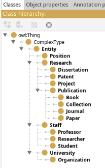
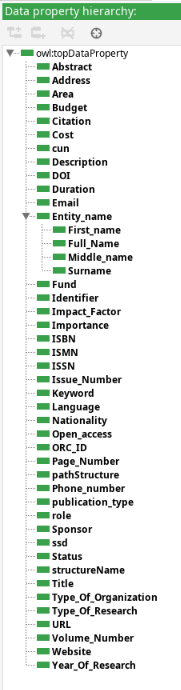
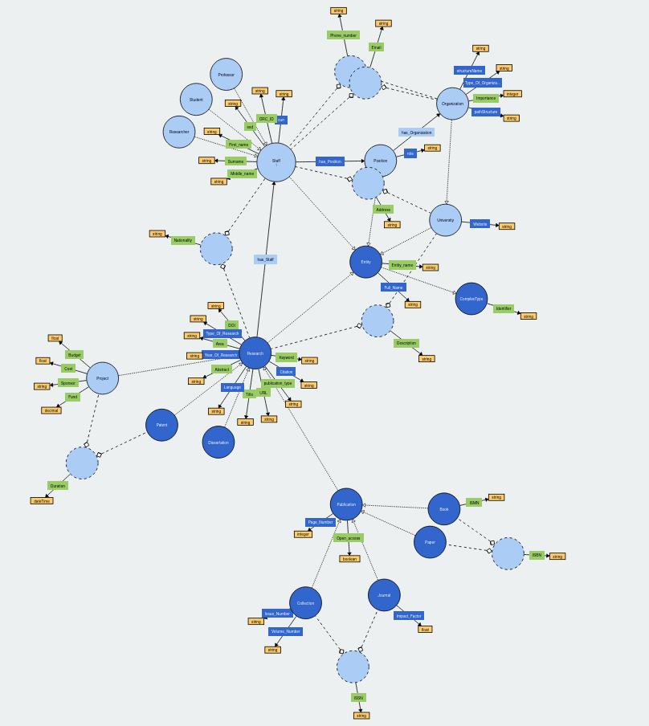
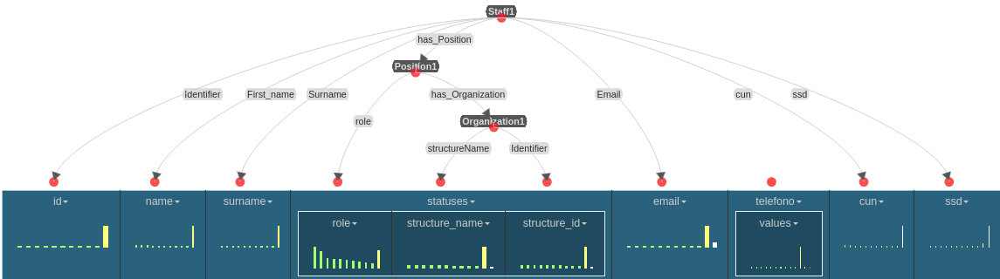

# Introduction
This repository contains the project created for the course "Knowledge Graph Engineering" at the University of Trento during the academic year 2024/2025, the title of the project is "International Digital University".
The project aims to create a knowledge graph that represents the collaborations between universities, in terms of projects, publications and staff. In order to achieve this goal the iTelos methodology has been used, which is a methodology divided in different phases whose result is the final knowledge graph.

> [!NOTE]  
> This page only contains an extract of the actual work performed to achieve the final Knowledge Graph. To get a better understanding it is strongly advised to read the full report found in the repository.

# Phase 1

In the first phase different aspects of the project are defined:
- Informal Purpose
- Domain of Interest
- Scenarios
- Personas
- Competency Questions
- ER model

Some examples will be provided in the following subsections, a more comprehensive explanation of each element can be found in the PDF report.
## Personas 
The personas are the people who will use the knowledge graph, some examples are:
| Name | Age  | Role |
| :--- | :--- | :--- |
| Dr. Maria Rossi | 28 | Researcher at University of Trento|
| Prof. Bat Erdene | 41 | Senior Lecturer at National University of Mongolia|
## Competency Questions

Competency questions are used to define how the different personas will use the knowledge graph, some examples are:

| Personas                        | Field                    | Question                                                     |
| ------------------------------- | ------------------------ | ------------------------------------------------------------ |
| Bat Erdene, Enkhtuul Tserendorj | Facilities and Locations | What are the main research facilities available at both the University of Trento and the National University of Mongolia for collaborative research? |
| Bat Erdene                      | Researcher Information   | Which students are pursuing a PhD in Computer Science?       |

## ER model

# Phase 2

The second phase of the methodology is the **Information Gathering phase**, the objective of this phase is to collect the data needed to create the Knowledge Graph and answer the competency questions. The sources we used are:

- UNITN’s LiveData Platform
- UniTN's Website
- NUM's LiveData Platform

The LiveData Platforms provide high quality datasets which are suitable for the use in a Knowledge Graph, on the other hand the Website uses APIs to get information and show it to the user. In order to get a dataset out of the Website we used a python script to automatically access the APIs and extract the data. A complete list of the gathered datasets can be found in the [sources.md](https://github.com/GaiaPizzuti/KGE-project/blob/main/Phase%202%20-%20Information%20Gathering/sources.md) file.

# Phase 3

The third phase of the methodology is the **Language Definition phase**. During this phase, starting from the work performed during the first two phases, a formalized domain-specific language is created. Since the project handles data from both the University of Trento (located in Italy) and the National University of Mongolia (located in Mongolia) it was important to handle the language differences in the data. This was done thanks to the creation of a **Language Resource**. Moreover since the Mongolian language uses the Cyrillic alphabet, before translating these terms it was also necessary to transliterate the characters to the Latin alphabet, this was achieved by using the [cyrtranslit](https://pypi.org/project/cyrtranslit/) python library.

# Phase 4

The fourth phase of the methodology is the **Knowledge Definition phase**. This phase requires the modeling of the:

- **Ontology**: which is used to formalize the relationship between entities;
- **Teleology**: which gives a definition and a purpose to the entities;
- **Teleontology**: which is a combination of the **Ontology** and the **Teleology**. The advantage of the **Teleontology** is that it leverages the rigidity of the Ontology and the flexibility of the Teleology.

To create this elements the tool [Protége](https://protege.stanford.edu/) is used, in the following section some examples of the modeling created using this tool will be shown. Additionally to make the modeling of the Teleontology easier the dataset were updated to better align with the keys defined in the Teleology.

## Examples

## Teleontology visualization

The Teleontology was visualized using [WebVOWL](https://github.com/VisualDataWeb/WebVOWL)

# Phase 5

The fifth and last phase of the iTelos methodology the Teleontology and the datasets, which were cleaned and aligned in the last phase, are merged. This operation is executed with the tool [Web-Karma](https://github.com/usc-isi-i2/Web-Karma) (also known as Karma).

During this phase three important steps are performed:

1) **Entity matching**: which employs reconciling different representations of the same real-world entity across
   multiple datasets. This step was trivial since most of the work necessary for it was performed during the other phases.  
2) **Entity Identification**: which employs giving a unique identifier to each entity and making it consistent across different datasets.  
3) **Entity Mapping**: which employs actually connecting the Teleontology with the datasets, which was done by using Karma.  

After the last step a collection of *.ttl* files was outputed, one for each dataset. An example of the linking process can be found below.

# Evaluation

This section describes how the coverage of the Knowledge Graph in regard of the Domain Knowledge, which is used to answer the Competency Questions, was evaluated. Six metrics were used, divided into two main categories:

- **Knowledge Layer evaluation**:. This evaluation is performed according to four metrics:
  - Competency Questions coverage: This evaluation measures how well the Teleontology satisfies the Competency Questions defined at the start of the process. This is calculated using two metrics which indicate the coverage of the entity types and the properties over the Competency Questions;
  - Reference Ontology coverage:  This evaluates how much of the Teleontology is aligned with reference ontologies, improving its interoperability and potential for reuse. This is calculated using with two metrics which indicate the coverage of the entity types and the properties over the reference Ontology;
- **Data layer evaluation**: This evaluation measures how many meaningful relationships (object properties) exist between entities. It is composed of two metrics: 
  - Entity connectivity: This metric is measured as the number of object property connections between ETypes;
  - Property connectivity: This metric measures the proportion of data properties with non-null values per EType.

